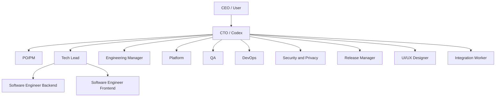
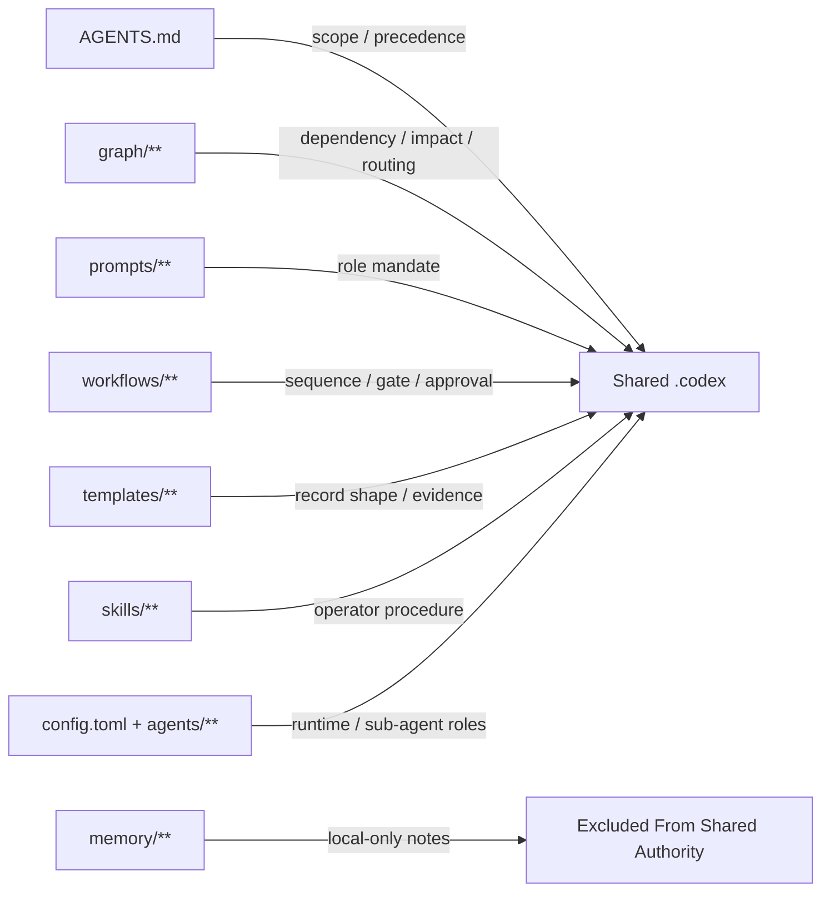
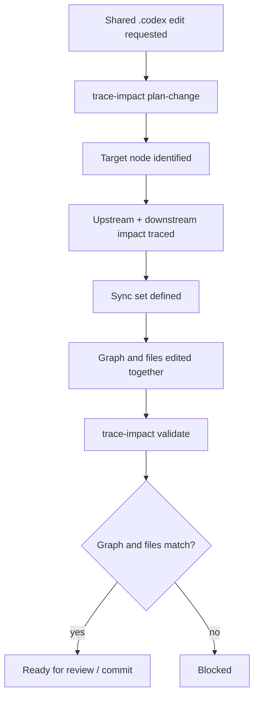
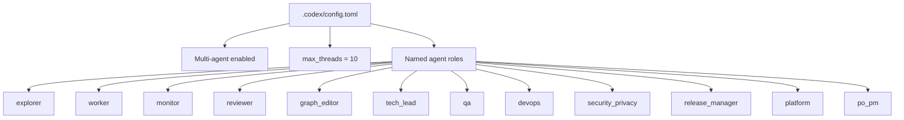
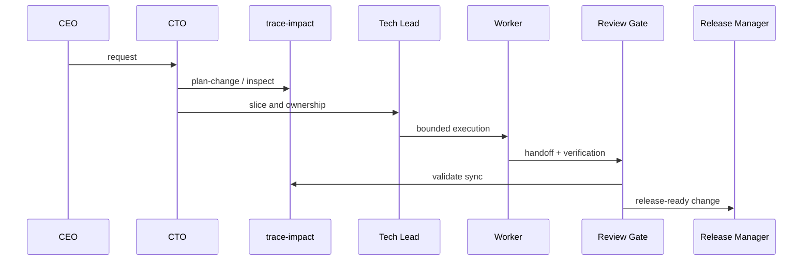

# Codex Agents Skillpack

Graph-governed multi-agent operating system for Codex.

This repo packages a reusable `.codex/` layer for teams that want:

- department-style role separation
- graph-first change control
- script-enforced sync between docs and dependency topology
- project-shared multi-agent role config
- compact skills, explicit workflows, machine-scannable templates

## Why It Is Different

Most agent setups are prompt piles.

This one is an operating system:

- `AGENTS.md` sets scope and precedence
- `graph/` is the dependency registry and impact-control layer
- `graph/scripts/trace-impact.mjs` is the enforcement surface
- `prompts/` define role mandates
- `workflows/` define decision loops and gates
- `templates/` define recurring records
- `skills/` define operator procedures
- `config.toml` enables multi-agent runtime and role registration

## System Map



## Asset Allocation



## Graph Change Control



## Runtime Model



## Delivery Flow



## Repository Layout

```text
.codex/
├─ AGENTS.md
├─ config.toml
├─ agents/
├─ graph/
│  ├─ dependency-graph.yaml
│  └─ scripts/trace-impact.mjs
├─ prompts/
├─ workflows/
├─ templates/
├─ skills/
└─ memory/
```

## Core Rules

- Shared `.codex` edits must run graph-script preflight and postflight.
- Graph and docs are not allowed to drift.
- One prompt = one role mandate.
- One workflow = one decision loop.
- One template = one record shape.
- One skill = one operator procedure.
- `memory/` is local-only and excluded from shared authority.

## Minimal Commands

```bash
# impact preflight
node .codex/graph/scripts/trace-impact.mjs plan-change --path .codex/config.toml

# graph validation
node .codex/graph/scripts/trace-impact.mjs validate

# codex runtime entrypoint
pnpm codex:graph -- inspect --id cto-prompt
```

## What You Can Reuse

- `.codex/config.toml`
- `.codex/agents/*.toml`
- `.codex/graph/**`
- `.codex/prompts/**`
- `.codex/workflows/**`
- `.codex/templates/**`
- `.codex/skills/**`

Avoid copying:

- `.codex/memory/**`

## Public Export Set

If you are publishing this as a standalone skillpack, the attractive core is:

- root `README.md`
- `.codex/config.toml`
- `.codex/agents/**`
- `.codex/graph/**`
- `.codex/prompts/**`
- `.codex/workflows/**`
- `.codex/templates/**`
- `.codex/skills/**`

## Status

Current properties of this skillpack:

- graph-script-enforced shared-asset edits
- role-complete multi-agent runtime config
- Mermaid visualizations for organization, runtime, and change control
- staged for extraction into a public repository
